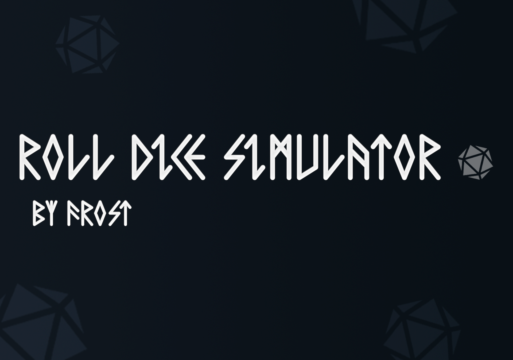

<h1 align="center"> 🎲 Roll Dice Simulator 🎲 </h1>

  <a href="#-tecnologias">Tecnologias</a>&nbsp;&nbsp;&nbsp;|&nbsp;&nbsp;&nbsp;
  <a href="#-projeto">Projeto</a>&nbsp;&nbsp;&nbsp;|&nbsp;&nbsp;&nbsp;
  <a href="#-uso">Uso</a>&nbsp;&nbsp;&nbsp;|&nbsp;&nbsp;&nbsp;
  <a href="#memo-licença">Licença</a>

  

 

  

## 🚀 Tecnologias

Esse projeto foi desenvolvido com as seguintes tecnologias:

- HTML e CSS
- JavaScript
- Git e Github

## 💻 Projeto

O projeto Roll dice simulator serve para aqueles que querem rolar seus diversos dados de rpg, mas não tem um em casa.
 Para isso foi feito um site onde pode rolar todos os dados, e até personalizar o número de lados que tenha o devido dado.

## 📌 Uso

Para o uso correto do Roll dice Simulator, você tera duas alternativas.

### 🖐 Manual 

O uso manual funciona da seguinte forma.
Copie os dados dos arquivos .html .css .js, assim você terá clonado o código e poderá usar o Roll Dice Simulator

### 💻 Online

O uso online você poderá acessar por [ESTE LINK](https://leoclink77.github.io/Roll-dice-simulator/)

## :memo: Licença

Esse projeto está sob a licença MIT.

---

Feito com ♥ by [Frost](https://bento.me/frost)
